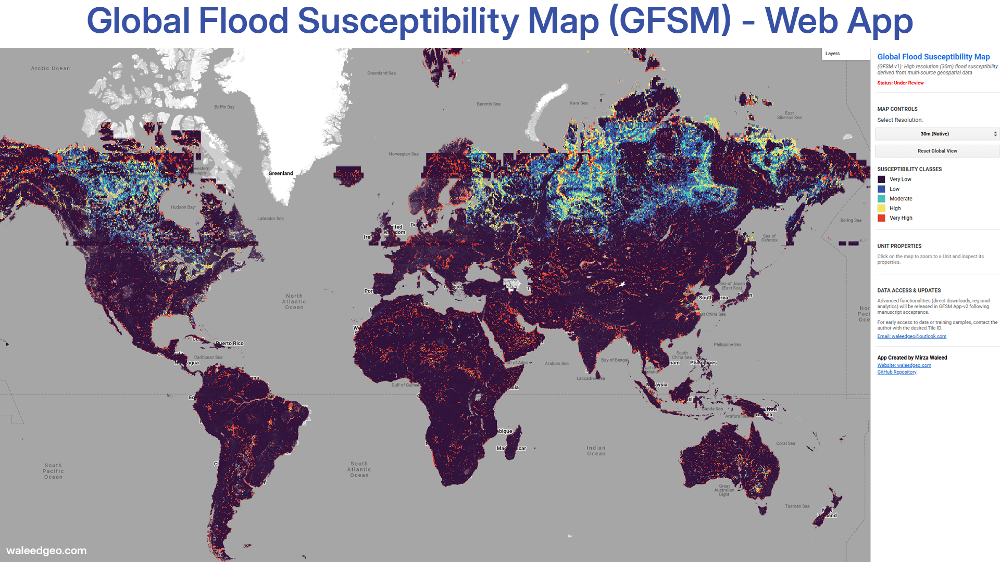

<div align="center">
  <a href="https://waleedgis.users.earthengine.app/view/gfsm">
    
  </a>

  <h1 align="center">Global Flood Susceptibility Map (GFSM v1)</h1>
  <p align="center">
    <strong>A High-Resolution (30m) Global Dataset Derived from Multi-Source Geospatial Data</strong>
    <br />
    <br />
    <a href="https://waleedgis.users.earthengine.app/view/gfsm"><strong>Launch GEE App »</strong></a>
    <br />
    <br />
    <a href="#methodology">Methodology</a>
    ·
    <a href="#citation">Citation</a>
    ·
    <a href="#author--contact">Contact Author</a>
  </p>

  <p align="center">
    
    
    
    <a href="https://creativecommons.org/licenses/by-nc-sa/4.0/">
      
    </a>
  </p>
</div>

<br />

## Overview

**GFSM v1** is the first globally harmonized flood susceptibility dataset produced at a native **30-meter spatial resolution**. Unlike traditional hazard models that rely on hydrodynamic simulations for specific return periods (e.g., 1-in-100 years), GFSM identifies the landscape's inherent propensity for flooding based on physical geographic and environmental controls.

Developed using a **Gradient-Boosted Tree (XGBoost)** machine learning framework, the model integrates topographic, hydrological, meteorological, and anthropogenic factors trained on over 30 million samples across 192 distinct climate zones and on over 10,000 GB of High Resolution Satellite Data.

> **Project Status: Early Preview**
>
> The manuscript describing this dataset is currently **Under Review**. While the GEE Explorer App is live, full dataset downloads and advanced analytical tools will be released immediately following publication (GFSM v1).

> Currently under review at: *Nature Scientific Data*

> For early access to specific tiles or training samples for validation purposes, please [contact the author](#-author--contact) directly.

---

## GFSM Explorer App

Visualize and inspect the global dataset interactively using our Google Earth Engine web application. The app features smart-resolution switching and a click-to-inspect tool for detailed regional analytics.

<div align="center">
  <a href="https://waleedgis.users.earthengine.app/view/gfsm">
    
  </a>
</div>

> Click the image above to launch the app.

### Key App Capabilities:
* **Global Screening:** Rapidly visualize susceptibility patterns from global to local scales.
* **Resolution Toggling:** Switch between 1km overview layers and native 30m analysis layers.
* **Unit Inspector:** Click any location to view specific model performance metrics (AUC, F1-Score) for that region (coming soon).


---

## Key Features

* **Global Coverage:** Spans all inhabited landmasses from ~80°N to ~60°S.
* **High Precision:** Native 30m resolution allows for localized exposure assessment and infrastructure planning.
* **Data-Driven:** Trained on ~17,000 grid tiles using a robust XGBoost architecture.
* **Harmonized Inputs:** Integrates 9 consistent global flood conditioning factors:
    * *Topographic:* Elevation (FABDEM), Slope, Aspect.
    * *Hydrological:* HAND (Height Above Nearest Drainage), TWI (Topographic Wetness Index), Distance to Water.
    * *Anthropogenic/Land:* Distance to Roads, NDVI (Sentinel-2).
    * *Climate:* Rainfall Frequency (GPM IMERG).
* **Robust Validation:** Achieved a global median AUC of **~0.95**, demonstrating high reliability across diverse terrains.

---

## Methodology

The generation of GFSM v1 followed a rigorous, high-performance computing workflow (involving distributed computing and advanced machine learning techniques on [SHAHEEN-III](https://www.kaust.edu.sa/en/research/shaheen) and [Google Earth Engine](https://earthengine.google.com/)). Details will be updated upon manuscript acceptance, but feel free to [reach out](#author--contact) for preliminary insights.

### Susceptibility Classes

| Class | Level | Description |
| :---: | :--- | :--- |
| **1** | **Very Low** | Areas with negligible flood propensity (e.g., high ridges, steep slopes). |
| **2** | **Low** | Areas with minimal risk factors. |
| **3** | **Moderate** | Transitional zones with some flood-prone characteristics. |
| **4** | **High** | Areas with significant flood conditioning factors. |
| **5** | **Very High** | Critical zones (floodplains, depressions) with maximum propensity. |

---

## Repository Structure

This repository serves as the code and documentation hub for the project.

More details and scripts will be released upon manuscript acceptance.

```text
GFSM/
├── src/
│   ├── img/              # Assets for README (Logo, Banner, Screenshot)
│   └── scripts/          # GEE JavaScript/Python inference codes (Pending Release)
├── LICENSE               # Creative Commons License details
└── README.md             # Project documentation

```

---

## Roadmap & Data Availability

| Feature | Status | Timeline |
| --- | --- | --- |
| **GFSM Explorer (v1)** | Live | Available Now |
| **Manuscript Publication** | Pending | Under Review |
| **Dataset Download (GeoTIFFs)** | Locked | Release upon acceptance |
| **GFSM Toolbox (v2)** | In Development | Release upon acceptance |

> **Research Access:** Researchers requiring early access to specific tiles or training samples for validation purposes may [contact the author](#-author--contact) directly with reasonable request.

---

## Citation

If you use this work or the app in your research, please cite the following (details to be updated upon publication):

```bibtex
@article{waleed2025gfsm,
  title={Global Flood Susceptibility Map (GFSM v1): A high resolution (30m) flood susceptibility dataset derived from multi-source geospatial data},
  author={Waleed, Mirza, and Sajjad, Muhammad, and Sami, Ghamdi, and Meng, Gao},
  journal={Under Review},
  year={2026}
}

```

OR

Cite following papers that underpin the methodology:

- Waleed, M., & Sajjad, M. (2025). High-resolution flood susceptibility mapping and exposure assessment in Pakistan: An integrated artificial intelligence, machine learning and geospatial framework. International Journal of Disaster Risk Reduction, 121, 105442. https://doi.org/10.1016/j.ijdrr.2025.105442

- Waleed, M., & Sajjad, M. (2025). Advancing flood susceptibility prediction: A comparative assessment and scalability analysis of machine learning algorithms via artificial intelligence in high-risk regions of Pakistan. Journal of Flood Risk Management, 18(1), e13047. https://doi.org/10.1111/jfr3.13047

---

## Author & Contact

**Mirza Waleed**
<br />
*GeoAI & Environmental Risk Researcher*

* **Website:** [waleedgeo.com](https://waleedgeo.com)
* **Email:** [waleedgeo@outlook.com](mailto:waleedgeo@outlook.com)
* **GitHub:** [@waleedgeo](https://github.com/waleedgeo)
* **LinkedIn:** [Mirza Waleed](https://www.linkedin.com/in/waleedgeo)

---

## License

This work is licensed under a <a rel="license" href="http://creativecommons.org/licenses/by-nc-sa/4.0/">Creative Commons Attribution-NonCommercial-ShareAlike 4.0 International License</a>.


<div align="left">
<a rel="license" href="http://creativecommons.org/licenses/by-nc-sa/4.0/">

</a>
</div>

Under this license, you are free to share and adapt the material, provided you give appropriate credit, do not use it for commercial purposes, and distribute any derivative works under the same license. For full license details, please visit the <a href="https://creativecommons.org/licenses/by-nc-sa/4.0/">Creative Commons website</a>.