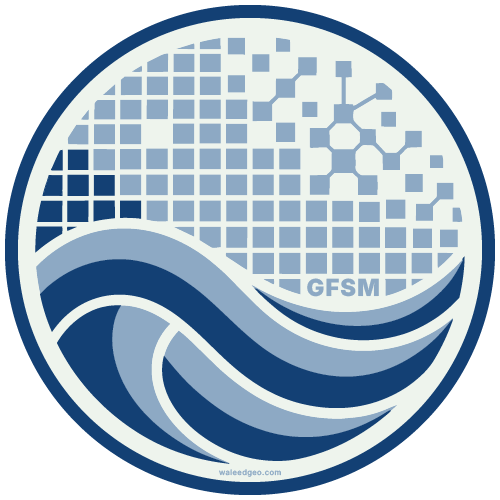
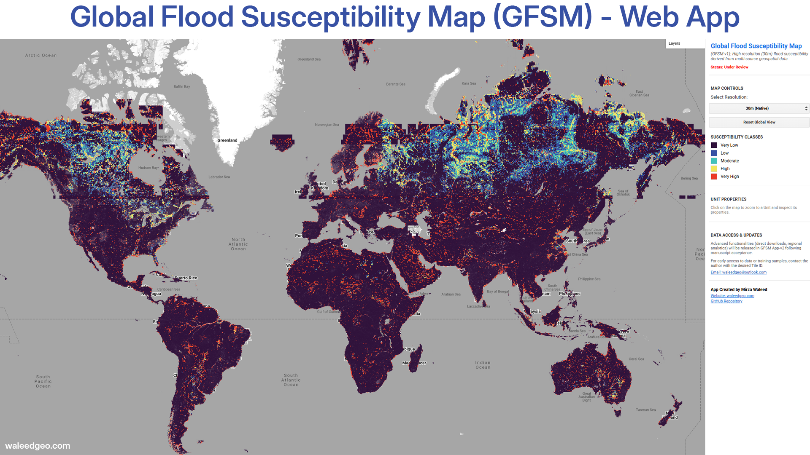

<div align="center">
  <a href="https://gfsm.waleedgeo.com">
    
  </a>

  <h1>Global Flood Susceptibility Map (GFSM v1)</h1>

  <p>
    <strong>A globally harmonized 30 m flood susceptibility dataset built from multi-source Earth observation and geospatial data.</strong>
  </p>

  <p>
    <a href="https://doi.org/10.1038/s41597-026-08338-1"><strong>Read the paper</strong></a>
    ·
    <a href="https://gfsm.waleedgeo.com"><strong>Explore the map</strong></a>
    ·
    <a href="https://zenodo.org/records/20568218"><strong>Download the data</strong></a>
    ·
    <a href="#quickstart"><strong>Get started</strong></a>
  </p>

  <p>
    <a href="https://doi.org/10.1038/s41597-026-08338-1">
      
    </a>
    <a href="https://doi.org/10.5281/zenodo.20568218">
      
    </a>
    
    
    
    
  </p>
</div>

---

<p align="center">
  <a href="https://gfsm.waleedgeo.com">
    
  </a>
</p>

## What GFSM Provides

GFSM v1 maps relative flood susceptibility at 30 m resolution using five globally consistent classes. The dataset and its validation are described in the open-access *Scientific Data* paper, [*A high-resolution global flood susceptibility dataset derived from multi-source earth observation and geospatial data*](https://doi.org/10.1038/s41597-026-08338-1), published online on 23 September 2026.

This repository provides documentation, metadata, access instructions, compact validation metrics, Google Earth Engine scripts, Python examples, and minimal notebooks. Downstream flood-risk assessment with exposure and vulnerability layers is outside the scope of this repository.

## Key Resources

| Resource | Access |
| --- | --- |
| Published paper | [Scientific Data](https://doi.org/10.1038/s41597-026-08338-1) |
| Interactive dashboard | [GFSM Explorer](https://gfsm.waleedgeo.com) |
| Dataset archive | [Zenodo record](https://zenodo.org/records/20568218) ([DOI](https://doi.org/10.5281/zenodo.20568218)) |
| Google Earth Engine asset | `projects/floodsus/assets/fsm_ei5` |
| Source repository | [github.com/waleedgeo/GFSM](https://github.com/waleedgeo/GFSM) |

The Earth Engine asset is an `ImageCollection` containing approximately 17,000 GFSM 30 m tile images. The Zenodo record is the canonical dataset archive. GFSM v1 is the data-product name; the linked Zenodo deposit is record version v2.

## At a Glance

| Attribute | GFSM v1 |
| --- | --- |
| Output product | Five-class EI-5 GeoTIFF tiles |
| Spatial resolution | 30 m |
| Coordinate reference system | World Mercator (EPSG:3395) |
| Geographic coverage | Near-global land, approximately 80°N to 60°S |
| Spatial tiles | 17,069 processed global tiles |
| Modelling units | 192 country or country-climate units |
| Training samples | Approximately 30.45 million |
| Training label source | Aqueduct Flood Hazard Maps v2, 5-year baseline |
| Internal validation | Median ROC-AUC ~0.95; median AUPRC ~0.94 |
| DFO event correspondence | 79% within 5 km; 92% within 10 km |
| NoData | 0 = masked or unavailable |

## Class Legend

| Value | Class | Color |
| ---: | --- | --- |
| 0 | NoData / masked |  |
| 1 | Very Low |  |
| 2 | Low |  |
| 3 | Moderate |  |
| 4 | High |  |
| 5 | Very High |  |

## Quickstart

### Google Earth Engine

```javascript
var gfsmCollection = ee.ImageCollection('projects/floodsus/assets/fsm_ei5');
var gfsm = gfsmCollection.mosaic().select(0).rename('gfsm');
var validMask = gfsm.gte(1).and(gfsm.lte(5));

var palette = ['2c7bb6', 'abd9e9', 'ffffbf', 'fdae61', 'd7191c'];
Map.addLayer(gfsm.updateMask(validMask), {min: 1, max: 5, palette: palette}, 'GFSM v1');
Map.setCenter(90.4, 23.7, 7);
```

More Earth Engine examples:

| Script | Purpose |
| --- | --- |
| [`gee_quickstart.js`](data_access/gee_quickstart.js) | Load and visualize GFSM |
| [`gee_visualize_gfsm.js`](data_access/gee_visualize_gfsm.js) | Add masked classes and a map legend |
| [`gee_clip_and_export.js`](data_access/gee_clip_and_export.js) | Clip GFSM to an AOI and export to Drive |
| [`gee_area_by_class.js`](data_access/gee_area_by_class.js) | Summarize area by susceptibility class |

### Python

```bash
pip install -r examples/requirements.txt
python examples/read_gfsm_tile_python.py path/to/GFSM_tile.tif
python examples/calculate_area_by_class_python.py path/to/GFSM_tile.tif --output area_by_class.csv
python examples/plot_gfsm_tile_python.py path/to/GFSM_tile.tif --output gfsm_tile.png
```

Python examples:

| Script | Purpose |
| --- | --- |
| [`read_gfsm_tile_python.py`](examples/read_gfsm_tile_python.py) | Print CRS, resolution, bounds, NoData, and class counts |
| [`calculate_area_by_class_python.py`](examples/calculate_area_by_class_python.py) | Calculate class areas from a tile or clipped raster |
| [`plot_gfsm_tile_python.py`](examples/plot_gfsm_tile_python.py) | Save a class-colored PNG |

## Repository Map

```text
GFSM/
├── data_access/          # Zenodo, tile-index, and Earth Engine examples
├── metadata/             # Class legend, tile schema, variables, scope
├── examples/             # Lightweight Python scripts
├── notebooks/            # Minimal local-tile notebooks
├── validation_summary/   # Published summary metrics
├── docs/                 # Citation, limitations, FAQ, changelog
├── src/img/              # Logo and app screenshot
├── CITATION.bib
├── CITATION.cff
├── CONTRIBUTING.md
├── LICENSE
└── README.md
```

## Scope Boundaries

Included:

- Dataset access and citation guidance.
- Google Earth Engine visualization, clipping, export, and class-area examples.
- Python examples for local GeoTIFF tiles.
- Class legend, tile schema, variable definitions, and compact validation summary.
- Responsible-use and limitation notes.

Not included:

- Exposure or vulnerability integration workflows.
- Population, asset, or infrastructure overlay analysis.
- Country rankings, hotspot rankings, damage estimates, or risk scores.
- Draft material for downstream GFSM-based flood-risk assessment studies.

## Validation Summary

The compact validation table in [`validation_summary/summary_metrics.csv`](validation_summary/summary_metrics.csv) reports the paper-level metrics intended for public reference. Internal ROC-AUC and AUPRC values describe discrimination against model-derived labels. DFO correspondence values provide independent event-based plausibility context.

## Responsible Use

GFSM is a susceptibility baseline, not a real-time flood forecast or event-specific inundation model. Use it for broad screening and comparative geospatial analysis, and combine it with local observations, flood-defense information, drainage infrastructure, engineering knowledge, and jurisdiction-specific planning guidance where possible.

See [`docs/known_limitations.md`](docs/known_limitations.md) and [`docs/faq.md`](docs/faq.md) for more detail.

## Citation

If you use GFSM v1, cite both the published paper and the dataset release.

**Paper**

Waleed, M., Sajjad, M., Al-Ghamdi, S. G., & Gao, M. (2026). A high-resolution global flood susceptibility dataset derived from multi-source earth observation and geospatial data. *Scientific Data*. https://doi.org/10.1038/s41597-026-08338-1

```bibtex
@article{waleed2026gfsm,
  author  = {Waleed, Mirza and Sajjad, Muhammad and Al-Ghamdi, Sami G. and Gao, Meng},
  title   = {A high-resolution global flood susceptibility dataset derived from multi-source earth observation and geospatial data},
  journal = {Scientific Data},
  year    = {2026},
  doi     = {10.1038/s41597-026-08338-1},
  url     = {https://doi.org/10.1038/s41597-026-08338-1}
}
```

**Dataset**

Waleed, M. (2026). Global Flood Susceptibility Map (GFSM v1): A high resolution (30m) flood susceptibility dataset derived from multi-source Earth observation and geospatial data [Data set]. Zenodo. https://doi.org/10.5281/zenodo.20568218

```bibtex
@dataset{waleed2026gfsm_data,
  author       = {Waleed, Mirza},
  title        = {{Global Flood Susceptibility Map (GFSM v1): A high resolution (30m) flood susceptibility dataset derived from multi-source Earth observation and geospatial data}},
  year         = {2026},
  publisher    = {Zenodo},
  version      = {v2},
  doi          = {10.5281/zenodo.20568218},
  url          = {https://doi.org/10.5281/zenodo.20568218}
}
```

Copy-ready BibTeX is available in [`CITATION.bib`](CITATION.bib), and GitHub-compatible machine-readable metadata is provided in [`CITATION.cff`](CITATION.cff). See [`docs/data_citation.md`](docs/data_citation.md) for citation guidance.

## Related Work

GFSM builds on recent flood susceptibility mapping and scalable GeoAI work:

- Waleed, M., & Sajjad, M. (2025). High-resolution flood susceptibility mapping and exposure assessment in Pakistan: An integrated artificial intelligence, machine learning and geospatial framework. *International Journal of Disaster Risk Reduction*, 121, 105442. https://doi.org/10.1016/j.ijdrr.2025.105442
- Waleed, M., & Sajjad, M. (2025). Advancing flood susceptibility prediction: A comparative assessment and scalability analysis of machine learning algorithms via artificial intelligence in high-risk regions of Pakistan. *Journal of Flood Risk Management*, 18(1), e13047. https://doi.org/10.1111/jfr3.13047

## License

Unless otherwise noted, GFSM data, metadata, and documentation are licensed under the Creative Commons Attribution 4.0 International License (CC BY 4.0). Code examples in this repository are licensed under the MIT License. See [`LICENSE`](LICENSE) for details.

## Project Contact

<div align="center">
  <h3>Mirza Waleed</h3>
  <p><strong>GeoAI, flood susceptibility mapping, and environmental risk research</strong></p>

  <p>
    <a href="https://waleedgeo.com">
      
    </a>
    <a href="mailto:waleedgeo@outlook.com">
      
    </a>
    <a href="https://github.com/waleedgeo">
      
    </a>
  </p>

  <p>
    For dataset access questions or GFSM dashboard issues, use the contact links above. For reproducible bug reports and contributions, see <a href="CONTRIBUTING.md">CONTRIBUTING.md</a>.
  </p>
</div>
